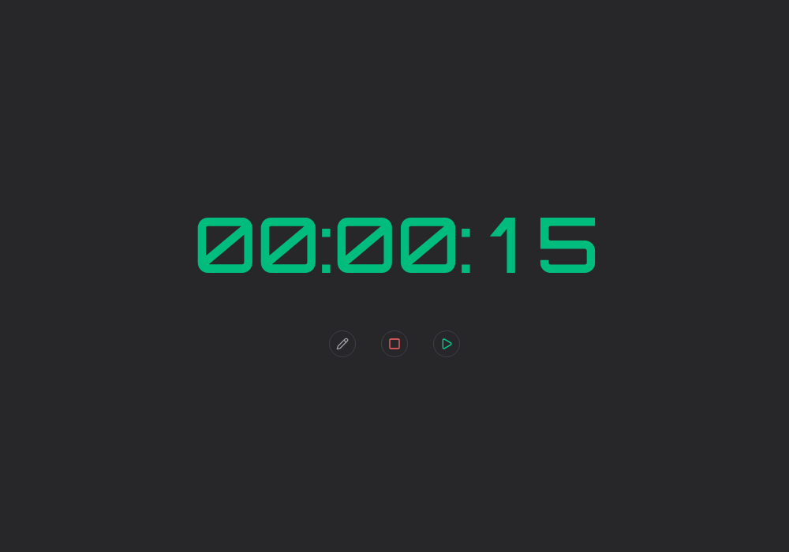

# ⏱️ Stopwatch

Um cronômetro/timer regressivo minimalista construído com React, TypeScript e Tailwind CSS. Permite editar o tempo diretamente nos dígitos, iniciar, pausar e resetar a contagem, com um alerta sonoro nos últimos 10 segundos.



## Funcionalidades

- Contagem regressiva com exibição em horas, minutos e segundos
- Edição do tempo dígito a dígito, direto na tela
- Iniciar / pausar / resetar a contagem
- Alerta visual (texto em vermelho) e sonoro nos últimos 10 segundos
- Ao pausar, o áudio de contagem regressiva pausa e retoma do mesmo ponto ao continuar

## Tecnologias

- [React 19](https://react.dev/)
- [TypeScript](https://www.typescriptlang.org/)
- [Vite](https://vite.dev/)
- [Tailwind CSS](https://tailwindcss.com/)
- [Lucide React](https://lucide.dev/) (ícones)

## Como rodar

Pré-requisitos: [Node.js](https://nodejs.org/) e [pnpm](https://pnpm.io/).

```bash
# instalar dependências
pnpm install

# iniciar em modo desenvolvimento
pnpm dev

# gerar build de produção
pnpm build

# pré-visualizar o build de produção
pnpm preview
```

O app fica disponível em `http://localhost:5173`.

## Estrutura do projeto

```
src/
├── App.tsx         # componente raiz
├── Stopwatch.tsx   # lógica e UI do cronômetro
├── main.tsx        # ponto de entrada
└── index.css        # estilos globais / Tailwind
public/
├── countdown.mp3   # som da contagem regressiva
├── favicon.svg
└── icons.svg
```
